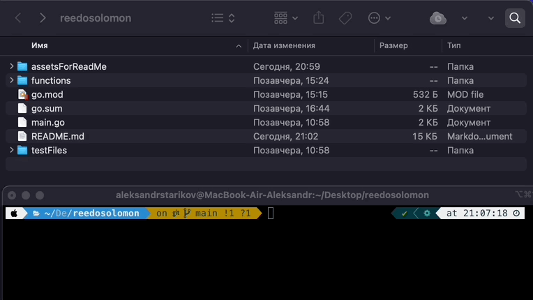
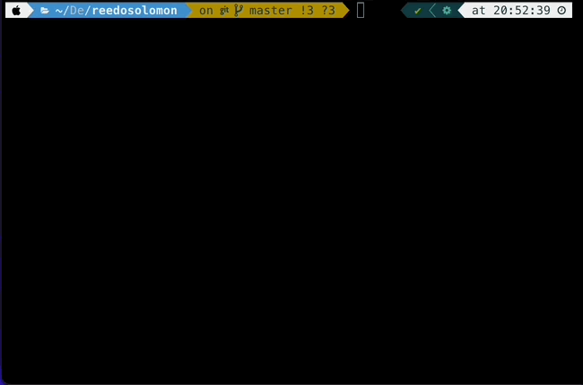
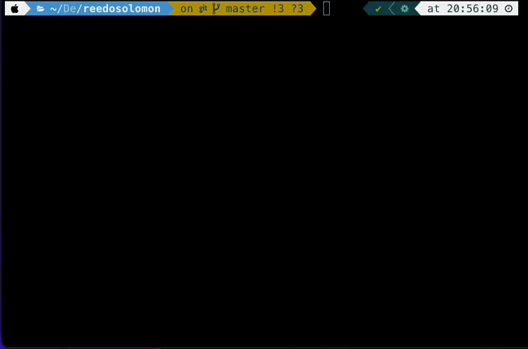

<!-- markdownlint-configure-file {
  "MD013": {
    "code_blocks": false,
    "tables": false
  },
  "MD033": false,
  "MD041": false
} -->

<div align="center">

# universal encoder/decoder reedosolomon


**This library is a universal file encoder and decoder using Ridosolomon codes with error correction**

It remembers which directories you use most frequently, so you can "jump" to
them in just a few keystrokes.<br />
zoxide works on all major shells.

[Getting started](#getting-started) •
[Installation](#installation) •
[Configuration](#configuration) •
[Integrations](#third-party-integrations)

</div>

# Use as compiled file

### *Step 1: Clone repo*

```sh
git clone https://github.com/mellanyx/reedosolomon.git
```

### *Step 2: Build project*

Let's go to the cloned project and execute the following command:

```sh
go build
```
After that the compiled file will appear




### *Step 3: Applications*

#### *Encode file*

```sh
./reedosolomon encode [file path] [primitive poligon 285 / 301] [eccsybmols]
```

Number of bugs to be fixed = eccsybmols * 2

For example, if we specify eccsybmols equal to 2, then the maximum number of errors that we can fix will be 4.




#### *Corrupt file*


```sh
./reedosolomon corrupt [file path] [eccsybmols]
```

eccsybmols - we specify the same value as when encoding. After execution, the program itself will damage every 256 bits with the number of errors equal to (eccsybmols / 2)




#### *Decode file*

```sh
./reedosolomon decode [file path] [primitive poligon 285 / 301] [eccsybmols]
```

primitive poligon - we specify the same value as when encoding.

eccsybmols - we specify the same value as when encoding and corrupt.

After execution, we should get our original fully working file


# Use as a library

### *Step 1: Import in your project*

```golang
package main

import "github.com/mellanyx/reedosolomon/functions"
```

### *Step 2: Usage*

#### *Encode file*

primitive = 285 and 301

Number of bugs to be fixed = eccsybmols * 2

For example, if we specify eccsybmols equal to 2, then the maximum number of errors that we can fix will be 4.

```golang
reedosolomon.EncodeFile(filepath, primitive, eccsymbols)
```

#### *Corrupt file*

eccsybmols - we specify the same value as when encoding. After execution, the program itself will damage every 256 bits with the number of errors equal to (eccsybmols / 2)

```golang
reedosolomon.CorruptFile(filepath, eccsymbols)
```

#### *Decode file*

```golang
reedosolomon.DecodeAndFixCorruptFile(flag.Args()[1], primitive, eccsymbols)
```

primitive poligon - we specify the same value as when encoding.

eccsybmols - we specify the same value as when encoding and corrupt.

After execution, we should get our original fully working file

